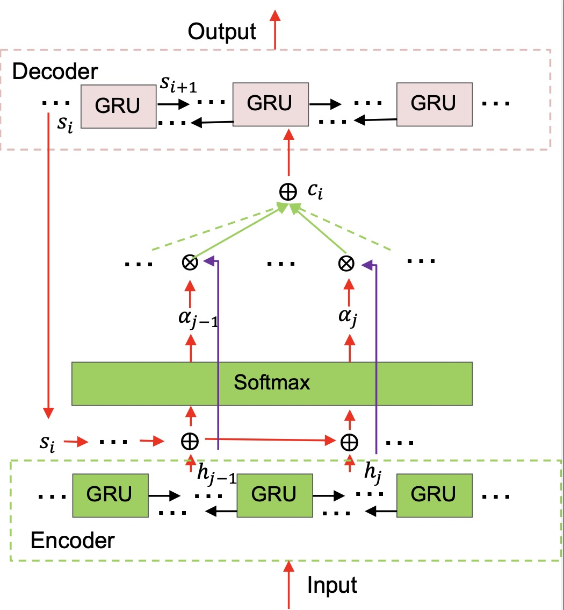
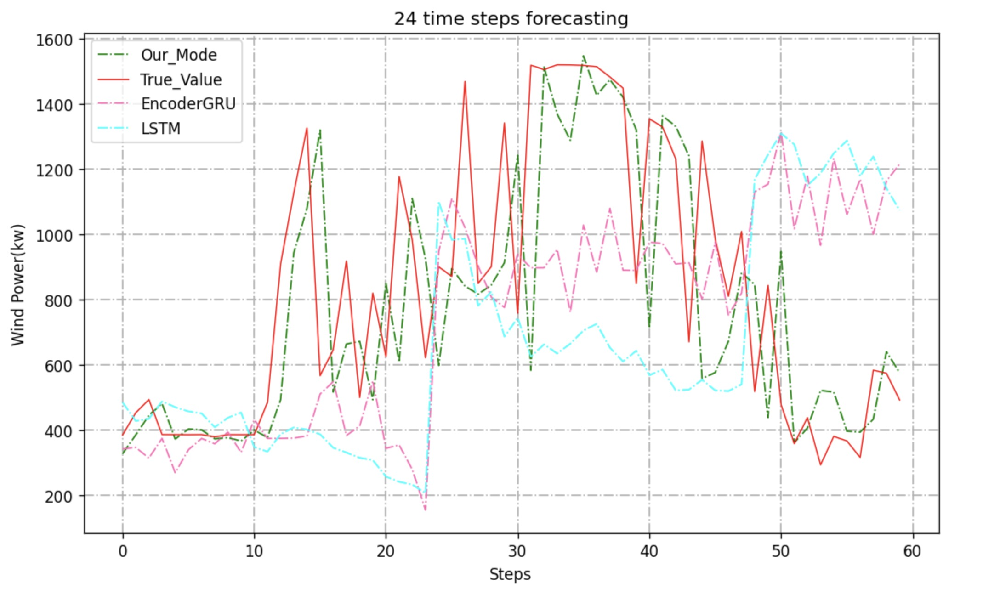

# KDD_Cup_2022_Wind_Competition

Code for KDD_Cup_2022_Wind_Competition, ranked at 46/2490.

This repository includes the model of an Encoder-Decoder GRU architecture enhanced with an attention mechanism.  
All work was completed by an individual team and achieved 46th place among 2490 teams.

---

## 🧠 Model Architecture

The framework of the proposed model is shown below:

  

The model adopts a sequence-to-sequence structure using GRU units, with an attention layer aggregating encoded temporal information into context vectors before decoding.

---

The prediction results comparison of the proposed model is shown below:

  

## 📁 Folder Structure

